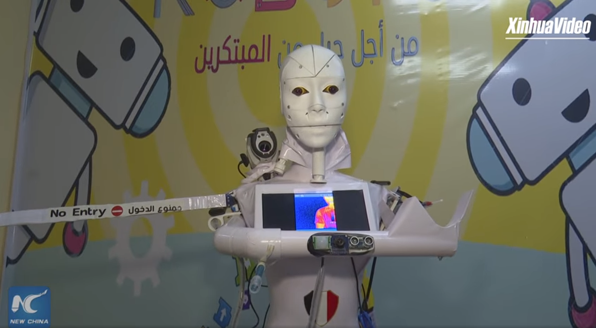

# flask-virtual-assistant
> Make your own arabic AI robot

[![NPM Version][npm-image]][npm-url]
[![Build Status][travis-image]][travis-url]
[![Downloads Stats][npm-downloads]][npm-url]

Make your Arabic assistant robot


## Installation

setup:

```sh
pip install -r requirements.txt
```


## Usage example

This code works with javascript speech to text and Ibm watson services you have to enter api key and url of [watson assistant](https://cloud.ibm.com/catalog/services/watson-assistant) where you choose arabic and add your own arabic questions in apikey.yml file and the code will record audio for 5 seconds and the assistant will answer you in [IBM](https://cloud.ibm.com)
_For more examples and usage, please refer to the [Wiki][wiki]._

## Development setup

Add the api keys in the apikey.yml 
```sh
python3 arabic_assistant
```

## Release History

* 0.1.0
    * The first proper release
* 0.0.1
    * Work in progress

## Meta

Ahmed ElShireef – [@Ahmed_ElShireef](https://www.facebook.com/ahmed1212005) – ahmed.121200569@gmail.com

Distributed under the license. See ``LICENSE`` for more information.

[https://github.com/Ahmed1262005/arabic_virtual_assistant](https://github.com/Ahmed1262005/arabic_virtual_assistant)

## Contributing

1. Fork it (<https://github.com/Ahmed1262005/arabic_virtual_assistant/fork>)
2. Create your feature branch (`git checkout -b feature/fooBar`)
3. Commit your changes (`git commit -am 'Add some fooBar'`)
4. Push to the branch (`git push origin feature/fooBar`)
5. Create a new Pull Request

<!-- Markdown link & img dfn's -->
[npm-image]: https://img.shields.io/npm/v/datadog-metrics.svg?style=flat-square
[npm-url]: https://npmjs.org/package/datadog-metrics
[npm-downloads]: https://img.shields.io/npm/dm/datadog-metrics.svg?style=flat-square
[travis-image]: https://img.shields.io/travis/dbader/node-datadog-metrics/master.svg?style=flat-square
[travis-url]: https://travis-ci.org/dbader/node-datadog-metrics
[wiki]: https://github.com/Ahmed1262005/arabic_virtual_assistant/wiki
